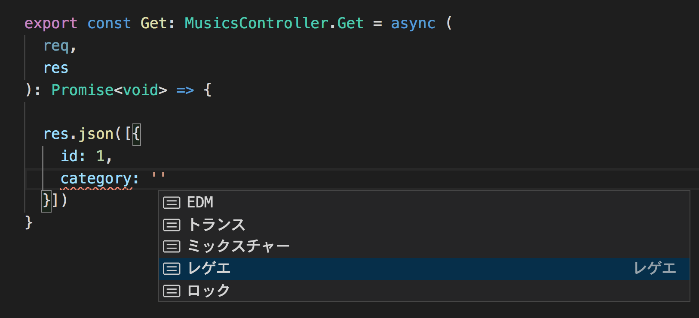

# express-ts-generator

It strongly support type definition for express request and response model in accordance with Open API


## Install

```sh
$ npm install dtsgenerator express-ts-generator --save
```

## Generate definition file

```sh
$ npx dtsgen openapi/openapi.yaml -o ./src/@types/openapi.d.ts && npx apigen -s ./src/@types/openapi.d.ts -d ./src/@types/api.ts
```

generated file will look like this

```ts
/* eslint-disable @typescript-eslint/no-namespace */
/* eslint-disable @typescript-eslint/no-explicit-any */
// eslint-disable-next-line @typescript-eslint/no-unused-vars
import { Controller } from 'express-api-generator';

export namespace Music$MusicIdController {
  export type Get = Controller<{
    response: Paths.Music$MusicId.Get.Responses.$200;
  }>;
}
export namespace MusicsController {
  export type Get = Controller<{
    response: Paths.Musics.Get.Responses.$200;
  }>;
  export type Post = Controller<{
    body: Paths.Musics.Post.RequestBody;
  }>;
}
```

## Usage

in express controller...

```ts
import { SomeController } from './types/api';
export const Post: SomeController.Post = async (
  request,
  response
): Promise<void> => {
  // request and response will be typed automatically
};

export const Get: SomeController.Get = async (
  request,
  response
): Promise<void> => {
  // request and response will be typed automatically
};
```

## You can see how useful it is!!




## Demo Repository

[Github](https://github.com/steelydylan/express-ts-generator-test)